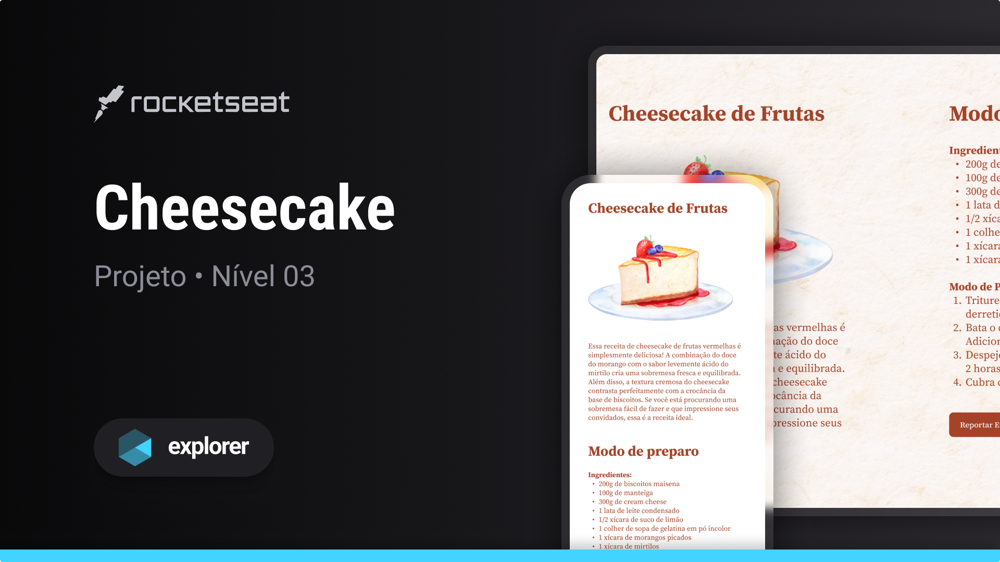

<div align="center">
  
  <h2 align="center">Cheesecake</h2>

</div>

<br/>

### Demo Screeshots



### About

This repository is a project developed in Stage 3 of [Rocketseat](https://github.com/Rocketseat) explorer, to put into practice and learn responsiveness in web development

### Prerequisites

Before you begin, ensure you have met the following requirements:

- [Git](https://git-scm.com/downloads "Download Git") must be installed on your operating system.

### Run Locally

To run **Cheesecake** locally, run this command on your git bash:

Linux and macOS:

```bash
sudo git clone https://github.com/denilsonbaptista/cheesecake.git
```

Windows:

```bash
git clone https://github.com/denilsonbaptista/cheesecake.git
```

### Contact

If you want to contact with me you can reach me at [Linkedin](https://www.linkedin.com/in/denilsonbaptista/).

### License

This project is **free to use** and does not contains any license.
